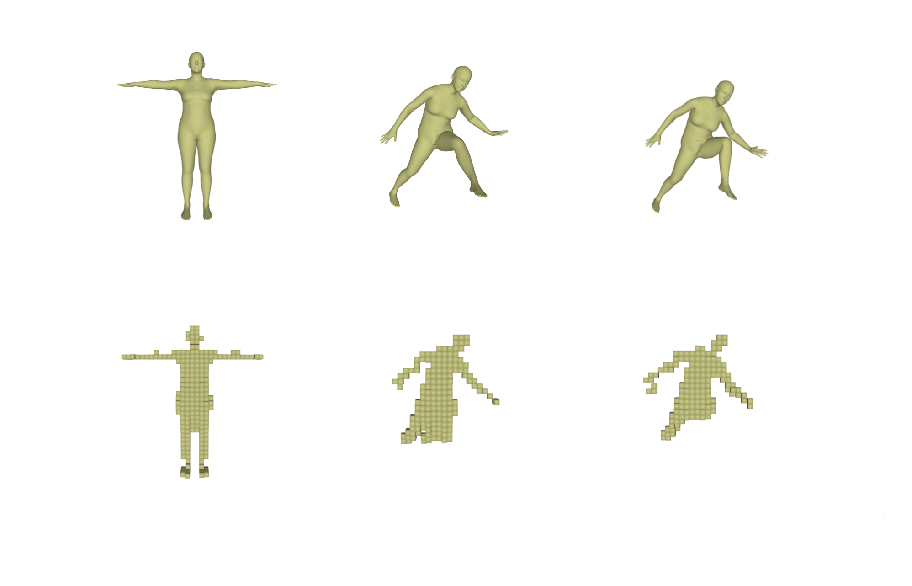

# NiLBS

## About

Implementation of [Neural Inverse Linear Blend Skinning](https://arxiv.org/pdf/2004.05980.pdf) extended to work in 3D.

## Installation

To install the package on Windows, Linux and MacOS run the following command `pip3 install NiLBS`.

Installing the package for use in a Colab notebook first requires installing libspatialindex using 
`!apt install libspatialindex-dev.
`

## Sample Output

## Running the demos

Code which demonstrates the usage of NiLBS can be found in the 'demo' folder. Running any of these scripts will open a pyglet window to show the output.

